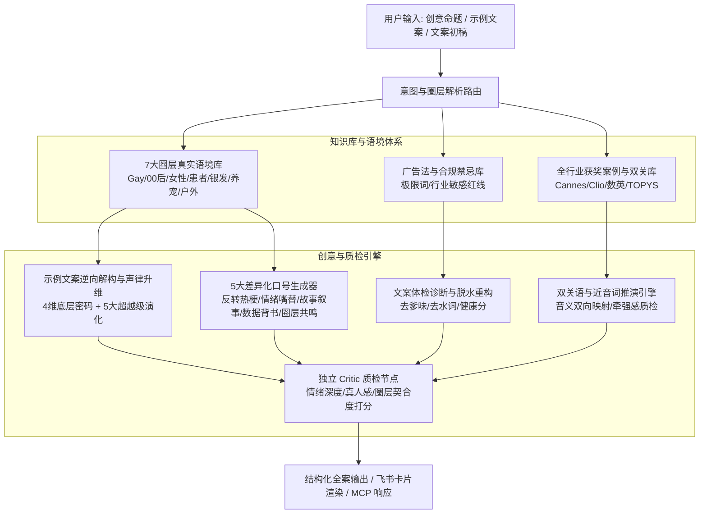

<div align="center">

# 🌌 via54ADIdeahub — 智能广告创意全案与圈层语境引擎

> **🌐 Language**: [🇨🇳 中文](#) (current) | [🇺🇸 English](./README_EN.md)

[](https://www.python.org/downloads/)
[](https://modelcontextprotocol.io/)
[](LICENSE)
[](tests/)
[](DESIGN.md)

</div>

---

> **专为品牌策划与广告创意人打造的工业级 AI 创意中台。**  
> 融合 **7 大垂直圈层真实语境库**、**示例文案逆向解构与升维引擎 (ExemplarReasoner)**、**5 大差异化口号流派**、**文案深度体检与脱水重构 (Copy Polisher)**、**概念双关推演引擎 (Pun Engine)** 与 **Critic 独立质检评分机制**，通过 **MCP (Model Context Protocol)** 协议赋能 AI 编程与创意工作流。

---

## 🚀 核心能力矩阵



### 1. 示例文案逆向解构与升维演化引擎 (`ExemplarReasoner`)
解决“只知例子好、不知好在哪、仿写拗口”的痛点：
- **4 重底层逆向工程**：剖析核心戏剧张力、中文平仄与声韵节奏（对称性/开合口韵母/气口留白）、0.5 秒直觉通感物象与修辞杠杆。
- **5 大超越级演化文案**：换用不同场景与修辞维度，推演出在“琅琅上口度”、“情绪穿透力”与“画面感”上全面超越原示范的方案，并附带升维对比自证。

### 2. 7 大垂直圈层语境知识库 (`audience_language/`)
拒绝生硬套词与“中年人装 00 后”的尴尬，提供涵盖**真实黑话、沟通语境、正反例对比与禁忌红线**的完整指南：
- **`gay` (LGBT+ 圈层)**：通关、全场、PLAY、开挂、营业、去说教、亲密安全
- **`genz` (00后 / 打工人)**：去班味、精神离职、反内卷、工位除锈、嘴替发疯
- **`women` (独立女性)**：自洽、主场力量、身体疆域、不被定义、松弛感
- **`patient` (医疗健康与患者心声)**：驱散病耻感、大白话痛点、生活掌控权、具象场景
- **`silver` (银发经济与新老年)**：第二人生、不添麻烦、尊严活力、平视陪伴
- **`pet` (养宠一族 / 毛孩子家长)**：毛孩子、情绪解药、治愈、科学喂养、无声告白
- **`outdoor` (山系青年 / 旷野自救)**：去旷野、身体在场、轻装自救、精神庇护所

### 3. 5 大差异化创意版本与 Critic 质检矩阵
- **一次性输出 5 种风格**：
  1. 🗡️ **反转热梗型 (Subversive Humor)**：反差幽默与社交货币
  2. 📢 **情绪嘴替型 (Unfiltered Voice)**：一针见血替用户说出心里话
  3. 🍃 **故事叙事型 (Cinematic Narrative)**：微感官蒙太奇与电影质感
  4. ⚡ **数据背书型 (Hardcore Authority)**：硬核事实与数字信任
  5. 🎯 **圈层共鸣型 (Subculture Identity)**：地道圈内暗号与情感归属
- **Critic 独立质检评分**：输出真实的 `emotion_score`、`humanity_score`、`audience_fit_score`，杜绝假大空套话。

### 4. 用户初稿诊断与润色工具 (Copy Polisher)
专为“我写初稿，AI帮我优化”设计：
- **全方位体检**：量化健康分（1-5分），自动诊断爹味说教、假大空行话、水词修饰及广告法违规。
- **三维重构方案**：一键输出 **锐利脱水版**、**情绪共鸣版**、**圈层地道版**。

### 5. 概念双关与谐音推演引擎 (Pun Engine)
- 基于表面动作与品牌心智双向推演，评估牵强感与翻车风险（Cringe Risk），杜绝低俗谐音烂梗。

---

## 🛠️ MCP (Model Context Protocol) 工具列表

本项目通过标准 `stdio` 协议暴露 8 个生产就绪的 MCP 工具：

| 工具名称 | 功能描述 |
|:---|:---|
| **`deconstruct_and_evolve_copy`** | 示例文案 4 维底层逆向解构，推演 5 大声韵升维文案 |
| **`reason_creative_strategy`** | 生成 5 大差异化口号全案、品牌宣言、超级符号及 Critic 质检打分 |
| **`polish_and_diagnose_copy`** | 对用户已有文案初稿进行爹味与水词诊断，并输出 3 维重构方案 |
| **`explore_creative_puns`** | 发散概念双关与谐音文案，并提供牵强感与翻车风险质检 |
| **`audit_advertising_compliance`** | 检查文案是否触犯广告法极限词或圈层敏感红线 |
| **`search_audience_language`** | 检索特定圈层的语言特征、黑话指南与禁忌避坑规则 |
| **`search_knowledge_base`** | 跨全行业创意案例与报告进行 TF-IDF 混合检索 |
| **`list_advertising_cases`** | 按行业、品牌、奖项等级（Cannes/Clio/Effie等）筛选案例 |

---

## 📦 快速开始

### 1. 环境准备
```bash
git clone https://github.com/veawho/via54ADIdeahub.git
cd via54ADIdeahub

# 创建并激活虚拟环境
python3 -m venv .venv
source .venv/bin/activate
pip install -r requirements.txt
```

### 2. 运行单元测试
```bash
PYTHONPATH=. python3 -m unittest discover -s tests
```

### 3. 接入 TRAE / Claude Desktop / Cursor
在您的 MCP 客户端配置文件中添加：
```json
{
  "mcpServers": {
    "via54ADIdeahub": {
      "command": "python3",
      "args": [
        "/absolute/path/to/via54ADIdeahub/mcp_server.py"
      ]
    }
  }
}
```

---

## 📄 License
本项目采用 [AGPL-3.0 License](LICENSE) 开源协议。
